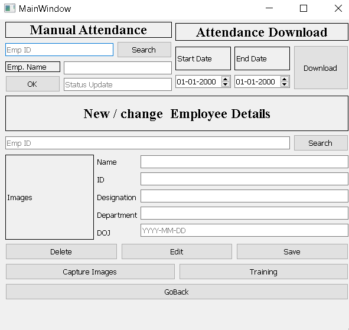

# EmployeeManagementUsingFaceRecognition
Stores employee details and manages daily attendance using face recognition technology.

## Features

Captures faces from frames and stores them in the dataset with unique id number.

Stores all the employee details in a database also, provides various other functionalities.



Daily attendace is stored in table of particular date.

Generates greeting through audio on detection.

### Installation 
```
pip3 install face_recognition
```

### Examples

```
import face_recognition 
```

Encodings

```
image = cv2.imread(imagePath)
rgb = cv2.cvtColor(image, cv2.COLOR_BGR2RGB)
boxes = face_recognition.face_locations(rgb, model="detection_method")
    # compute the facial embedding for the face
encodings = face_recognition.face_encodings(rgb, boxes)
```

## Usage

Enter details (If a new employee) and capture images.
After every addition to dataset, train the images.

For detection start the webcam.

